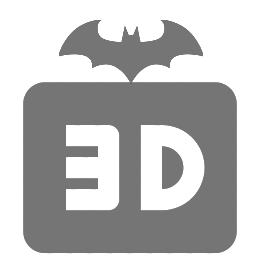
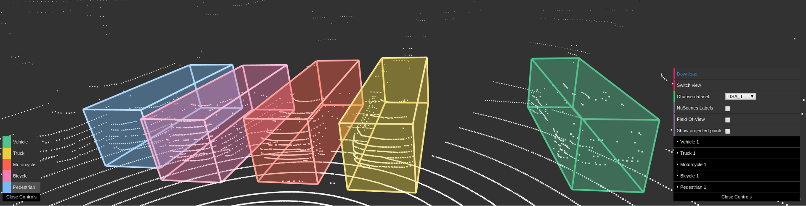
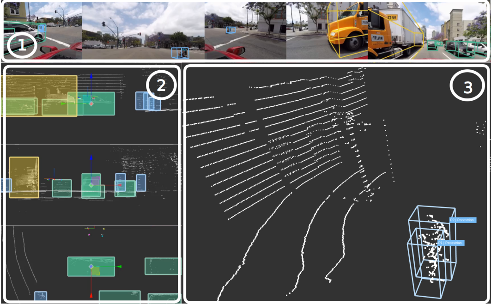
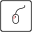

# 3D BAT

# 3D Bounding Box Annotation Tool

# Installation
1. Clone repository: `git clone https://github.com/walzimmer/3d-bat.git`
2. Install npm 
   + Linux: `sudo apt-get install npm`
   + Windows: https://nodejs.org/dist/v10.15.0/node-v10.15.0-x86.msi
3. Install PHP Storm (IDE with integrated server): https://www.jetbrains.com/phpstorm/download/download-thanks.html
4. [OPTIONAL] Install WhatPulse to measure the number of clicks and key strokes while labeling: https://whatpulse.org/
5. Open folder `3d-bat` in PHP Storm
5. Move into directory: `cd 3d-bat`
6. Install required packages: `npm install`
7. Open `index.html` with chromium-browser (Linux) or Chrome (Windows) within the IDE

# Overview

# Keyboard Shortcuts
| Key | Description   | |
| --- | ------------- |---|
|    | Toggle view (3D view/Bird's-Eye-View)||
|     |    | Move forward in 3D view (TODO)|
|     |    | Move left in 3D view (TODO)|
|     |    | Move backward in 3D view (TODO)|
|     |    | Move right in 3D view (TODO)|
|     |    | Move down in 3D view (TODO)|
|     |    | Move up in 3D view (TODO)|
|    | Enlarge camera image||
|    | Next frame     ||
|    | Previous frame   ||
|    | Interpolate    ||
|   | Snap to grid in 0.5m steps (floor alignment mode)  ||
|    | Enable/Disable Translation mode||
|     |    | Move selected object forward (TODO)|
|     |    | Move selected object to left (TODO)|
|     |    | Move selected object backward (TODO)|
|     |    | Move selected object to right (TODO)|
|     |    | Move selected object down (TODO)|
|     |    | Move selected object up (TODO)|
|    | Enable/Disable Rotation mode||
|     |   | Rotate selected object counter-clock-wise (TODO)|
|     |    | Rotate selected object clock-wise (TODO)|
|    | Enable/Disable Scaling mode ||
|     |  | Increase length along longitudinal axis (y-axis) (TODO)|
|     |  | Decrease length along longitudinal axis (y-axis) (TODO)|
|     |   | Decrease width along lateral axis (x-axis) (TODO)|
|     |   | Increase width along lateral axis (x-axis) (TODO)|
|     |   | Increase height along vertical axis (z-axis) (TODO)|
|     |  | Decrease height along vertical axis (z-axis) (TODO)|
|    | Increase arrow size ||
|    | Decrease arrow size ||
|    | Show/Hide X-axis ||
|    | Show/Hide Y-axis ||
|    | Show/Hide Z-axis (only in 3D mode)||
|    | Switch between different operation modes (translate, rotate, scale) (TODO) ||
|    | Select next object (TODO)||
Hints:
+ Select `Copy label to next frame` checkbox if you want to keep the label (position, size, class) for next frame
+ Use helper views to align object along z-axis (no need to switch into 3D view)
+ Label one object from start to end (using interpolation) and then continue with next object
+ **Do not** apply more than one box to a single object.
+ Check every cuboid in every frame, to make sure all points are inside the cuboid and **look reasonable in the image view**.

# Special Rules
+ **Minimum LIDAR Points** :
    + Label any target object containing **at least 10 LIDAR points**, as long as you can be reasonably sure you know the location and shape of the object. Use your best judgment on correct cuboid position, sizing, and heading.
+ **Cuboid Sizing** :
    + **Cuboids must be very tight.** Draw the cuboid as close as possible to the edge of the object without excluding any LIDAR points. There should be almost no visible space between the cuboid border and the closest point on the object.
+ **Extremities** :
    + **If** an object has extremities (eg. arms and legs of pedestrians), **then** the bounding box should include the extremities.
    + **Exception**: Do not include vehicle side view mirrors. Also, do not include other vehicle extremities (crane arms etc.) that are above 1.5 meters high.
+ **Carried Object** :
    + If a pedestrian is carrying an object (bag, umbrella, tools etc.), such objects will be included in the bounding box for the pedestrian. If two or more pedestrians are carrying the same object, the bounding box of only one of them will include the object.
+ **Use Images when Necessary**:
    + For objects with few LIDAR points, use the images to make sure boxes are correctly sized. If you see that a cuboid is too short in the image view, adjust it to cover the entire object based on the image view.

# Labels
**For every bounding box, include one of the following labels:**
1. **[Car](#car)**: Vehicle designed primarily for personal use, e.g. sedans, hatch-backs, wagons, vans, mini-vans, SUVs, jeeps and pickup trucks (a pickup truck is a light duty truck with an enclosed cab and an open or closed cargo area; a pickup truck can be intended primarily for hauling cargo or for personal use).   

2. **[Truck](#truck)**: Vehicles primarily designed to haul cargo including lorrys, trucks.

3. **[Motorcycle](#motorcycle)**: Gasoline or electric powered 2-wheeled vehicle designed to move rapidly (at the speed of standard cars) on the road surface. This category includes all motorcycles, vespas and scooters. It also includes light 3-wheel vehicles, often with a light plastic roof and open on the sides, that tend to be common in Asia (rickshaws). If there is a rider and/or passenger, include them in the box.

4. **[Bicycle](#bicycle)**: Human or electric powered 2-wheeled vehicle designed to travel at lower speeds either on road surface, sidewalks or bicycle paths. If there is a rider and/or passenger, include them in the box.

5. **[Pedestrian](#pedestrian)**: An adult/child pedestrian moving around the cityscape. Mannequins should also be annotated as `Pedestrian`.  

 # Detailed Instructions and Examples
